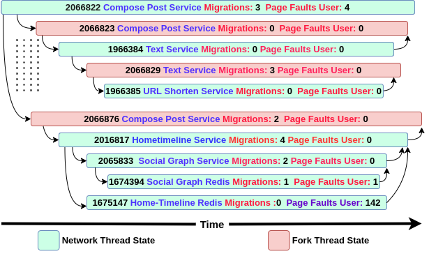

# MiSeRTrace

## What does MiSeRTrace do?

- MiSeRTrace traces the end-to-end path of requests entering a microservice application at the kernel space without requiring instrumentation or modification of the application. 
- Observability at the comprehensiveness of the kernel space allows breaking down of various steps in activities such as network transfers and IO tasks, thus enabling root cause based performance analysis and accurate identification of hotspots. 
- MiSeRTrace supports bpftrace as a tracing backend. ftrace support will also be integrated soon.
- Users can enable any of the tracepoints and features provided by bpftrace that they wish to monitor. MiSeRTrace initially identifies the request spans, i.e. the duration spent by a particular thread on servicing a client request or a subsequent internal request. Later each request span is associated with a unique request trace. MiSeRTrace subsequently buckets all the time-stamped user-enabled trace logs into the request spans that triggered them, and this data can be processed by feeding stubs of code into MiSeRTrace.

The following image is a pictorial representation of a request trace obtained when MiSeRTrace was put to use on an open-source microservice benchmark suite. As an example, the trace-points sched:sched_migrate_task and exceptions:page_fault_user were enabled for monitoring with the objective of counting the number of occurrences of these events. Each segment here represents a state that is generated on either a network transfer or a fork, whose span is represented by the length of the segment. The span of a state is concluded upon sending a response/termination of the thread. Each state in the figure shows the PID of the associated thread and the name of the microservice running on it. In this trace, PID 2066822 forks PID 2066823 which further sends a TCP request to PID 1966384. 

<p align="center">

</p>

## How to use MiSeRTrace?

### Pre-requisites -

1) Python >= v3.8
2) `pip3 install -r requirements/python3_requirements.txt`
3) It is recommended to build the latest version of bpftrace from source, since bpftrace is rapidly growing. This page (https://github.com/iovisor/bpftrace/blob/master/INSTALL.md) can used as a reference.

### Initial setup before tracing -

Start your microservice application (MiSeRTrace currently supports Docker as the containerization engine), and then run `gen-init-data.py`.

```
python3 utils/gen-init-data.py [-h] -n NETWORK [-i INPUTBT] -m METAFILE -o OUTPUTBT

arguments:
  -h, --help                        show this help message and exit
  -n NETWORK, --network NETWORK     docker_network_name
  -i INPUTBT, --inputbt INPUTBT     path/to/customInputBtFile.bt
  -m METAFILE, --metafile METAFILE  path/to/outputMetaFile.psv
  -o OUTPUTBT, --outputbt OUTPUTBT  path/to/outputBtFile.bt
```

By default, the OUTPUTBT FILE contains the probes used by MiSeRTrace in its implementation. If you wish to monitor more events provided by bpftrace, the .bt file containing these probes has to be passed as the INPUTBT argument.

Format of the probes in the INPUTBT FILE (the CUSTOM_EVENT, CUSTOM_CODE and CUSTOM_PRINT sections can be modified) -

```c
CUSTOM_EVENT
/@pids[tid] == 1/ //to ensure that only the processes in the docker network are traced
{
    \*
    CUSTOM_CODE
    *\
    printf("\"%s\"|\"%d\"|\"%llu\"|\"%d\"|\"%s\"| CUSTOM_PRINT \n", comm, tid, nsecs, cpu, probe);    
}
```

It is recommended to have only a single printf call in every probe. If multiple printfs are used in a single probe, the print outputs might be separated from one another in the captured trace logs since the volume of data being captured is high. Every printf call should print five compulsory pipe-separated values as listed in the code block above.

### Running a workload and recording the kernel traces -

After bpftrace has been started, wait for about 60 seconds before starting the workload so as to ensure that bpftrace has attached all the probes being monitored.

```
BPFTRACE_PERF_RB_PAGES=<Buffer size in pages> BPFTRACE_MAP_KEYS_MAX=<Value greater than the maximum number of unique pids in the docker network> BPFTRACE_LOG_SIZE=<Size in bytes of the log to store the .bt file> bpftrace <path/to/outputBtFile.bt> > trace.psv
```

Once the workload is complete, ensure that all the data has been moved from the ring buffers to disk before stopping bpftrace (one possible way is to ensure that that size of `trace.psv` is no longer growing at a large rate).

Ensure that no events are lost in `trace.psv`. If events are lost, a larger ring buffer size has to be allocated through `BPFTRACE_PERF_RB_PAGES`. Since a map is used in the bpftrace script to stores all the pids that have to to be traced, large values have to be assigned to `BPFTRACE_MAP_KEYS_MAX` and `BPFTRACE_LOG_SIZE` to avoid overflows.

Pass the captured pipe-separated trace file to `sort-bpftrace-output.py` to ensure that the trace logs are globally time-ordered across all CPUs.

```
python3 utils/sort-bpftrace-output.py [-h] -i INPUT -o OUTPUT

arguments:
  -h, --help                  show this help message and exit
  -i INPUT, --input INPUT     path/to/inputTrace.psv
  -o OUTPUT, --output OUTPUT  path/to/sortedOutput.psv

```

### Generating the request traces -

1) To capture the request spans from the trace logs

```
python3 src/generator.py [-h] -i INPUT -m METAFILE -g GATEWAY -o OUTPUT

arguments:
  -h, --help                        show this help message and exit
  -i INPUT, --input INPUT           path/to/inputTrace.psv, ensure the trace logs are sorted by time
  -m METAFILE, --metafile METAFILE  path/to/metaFile.psv
  -g GATEWAY, --gateway GATEWAY     docker gateway IP in ipv4 format
  -o OUTPUT, --output OUTPUT        path/to/dump.pickle
```

2) To generate request traces from the captured spans

```
python3 src/rendermain.py [-h] -i INPUT -t RENDERTYPE [-o OUTPUT] [-n RANGE] [-l TRACELOGS] [-r] [-f] [-c]

arguments:
  -h, --help                              show this help message and exit
  -i INPUT, --input INPUT                 path/to/dump.pickle
  -t RENDERTYPE, --rendertype RENDERTYPE  dag OR custom
  -o OUTPUT, --output OUTPUT              path/to/outputfile, default STDOUT
  -n RANGE, --range RANGE                 range of request traces to process, eg 1-4,6. All request traces processed by default
  -l TRACELOGS, --tracelogs TRACELOGS     path/to/sortedTraceLogs.psv, required with rendertype=custom
  -r                                      to obtain output in raw json format (works when used with rendertype=dag)
  -f                                      to format the raw json (works when used with -r and rendertype=dag)
  -c                                      to print colored output (works when used with rendertype=dag and WITHOUT -r)
```

If the render type chosen is custom, MiSeRTrace enables the ability to provide custom code stubs to process the captured data through-

- The functions `customInit, customConsumeRecord, customRetrieveData and customRecordValid` defined in the class `CustomThreadStateHandler` to process the data that belongs to every span.

- The functions `customInit, customConsumeRecord and customRetrieveData` defined in the class `CustomTraceHandler` to process the data associated with every request trace.

## Publication

More information about the architecture of MiSeRTrace can be obtained through the following pre-print - https://arxiv.org/abs/2203.14076. 

Please cite our work if you found MiSeRTrace helpful.

Thrivikraman V*, Vishnu R Dixit*, Nikhil Ram S*, Vikas K Gowda*, Santhosh Kumar Vasudevan, and Subramaniam Kalambur. 2022. MiSeRTrace: Kernel-level Request Tracing for Microservice Visibility. In Companion of the 2022 ACM/SPEC International Conference on Performance Engineering (ICPE ’22), April 9–13, 2022, Bejing, China. ACM, New York, NY, USA, 4 pages.

*\* contributed equally to the work*

<!-- - Record idle-always-running PIDS of the application
- Record IPs of the running containers
- The resulting file should be in the format should be in the format : `PID Container_Name Container_IP Container_Hash` separated by whitespace

- `trace-cmd record -e sched_switch -e sched_process_exit -e sched_process_fork -e sys_enter_sendto -e sys_exit_sendto -e inet_sock_set_state -e tcp_probe -e sys_enter_recvfrom -e sys_exit_recvfrom -e tcp_rcv_space_adjust -e sys_enter_sendmsg -e sys_exit_sendmsg -e sys_enter_write -e sys_exit_write -e sys_enter_read -e sys_exit_read -e sys_enter_recvmsg -e sys_exit_recvmsg -O norecord-cmd -O norecord-tgid -O event-fork -O function-fork $(get-all-pids socialnetwork_default | awk '{print
f "-P "$1" "}') -C global -c`
- Wait for the alert "Press Ctrl C to stop recording"
- Run the application workload in parallel
- Halt the trace record (with Ctrl C)

```shell
trace-cmd report -R -i <path to trace.dat> | grep -vEi "^cpu" | sed -E 's/,\s*/,/g' > report.txt
``` -->
